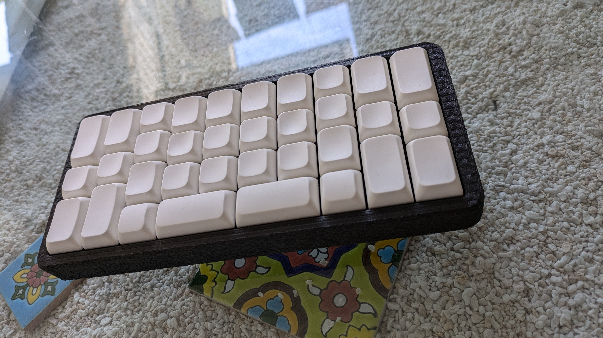
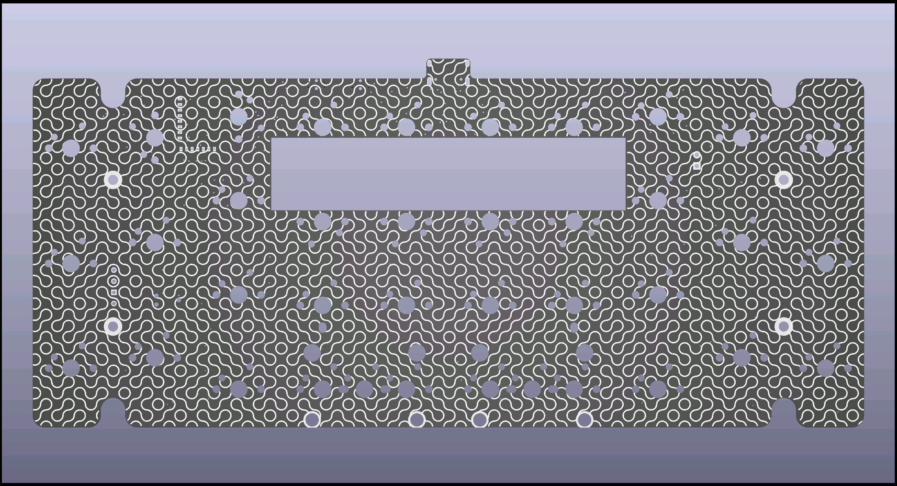
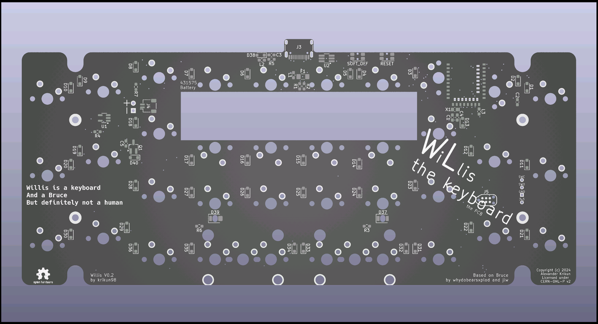

# Willis

The Willis is a wireless ZMK PCB for whydobearsxplod and jlw's [Bruce the Keyboard](https://github.com/josh-l-wang/Bruce-the-Keyboard-the-Resources).

It is licensed under the permissive CERN-OHL-P v2.

## Features

* Wireless with a built-in E73 module
* ZMK support via a [module](https://github.com/krikun98/willis-zmk-module)
* Fuses and ESD protection
* High Voltage mode for the best power efficiency
* Soldered MX 34- or 36-key layouts
* Meant for 431575 450 mAh battery in the PCB hole
* Externally accessible soft_off and reset buttons
* Math-generated silkscreen
* Is a keyboard
* Very much is not a human.

## Download

You can download Gerber files in the [releases section](https://github.com/krikun98/willis/releases).

## Instructions

### Firmware

The [bootloader](../../releases/download/V0.2/bootloader.hex) is available in the Releases tab.
Please refer to Joric's [nrfmicro wiki](https://github.com/joric/nrfmicro/wiki/bootloader) for the flashing instructions.
It's the same as the nrfmicro bootloader with a modified USB device name.

[Default firmware](../../releases/download/V0.2/firmware.zip) files for the 34-key layout are also there.
You can use the [Willis](https://github.com/krikun98/willis-zmk-config) config template for customization.
The firmware supports ZMK Studio.

[Miryoku](https://github.com/manna-harbour/miryoku_zmk) is strongly recommended, support is currently available in a PR.

### BOM/Build instructions

The interactive BOM is available next to the PCB files.

Please refer to the [nrfmicro wiki](https://github.com/joric/nrfmicro/wiki/soldering) for soldering/verification instructions.

## Links

### Version 0.2 PCB

[IBOM](https://htmlpreview.github.io/?https://github.com/krikun98/Willis/blob/V0.2/pcb/bom/ibom.html)

[gerbers](../../releases/download/V0.2/Willis_V0.2_gerbers.zip)

front|back
--|--
|

### Cases/plates

Willis is fully compatible with plates/cases for the original Bruce.

[Bruce case list](https://github.com/josh-l-wang/Bruce-the-Keyboard-the-Resources?tab=readme-ov-file#cases)

Plate files are also available in the [Bruce resources](https://github.com/josh-l-wang/Bruce-the-Keyboard-the-Resources) repository.

Willis-specific cases with the following modifications:

- Reset/soft_off buttons
- Battery cutout for larger batteries

Are currently in a pre-release stage and available by request.

## TODO

- [ ] BOM with links
- [ ] Test/fix PCBA files
